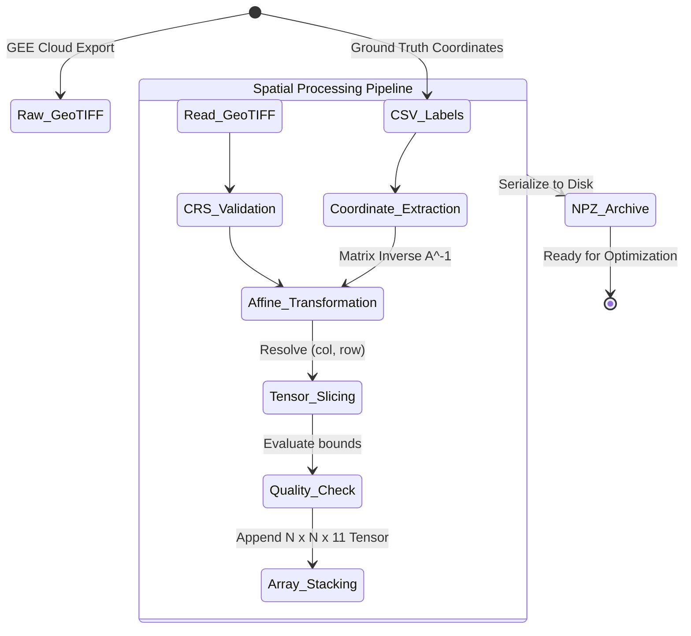
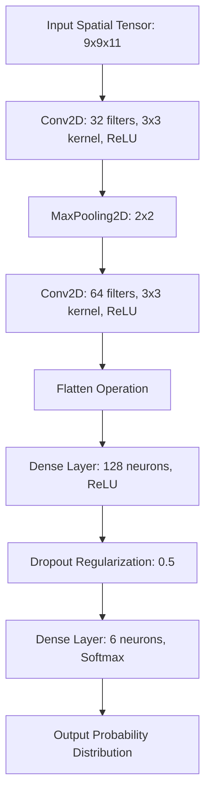
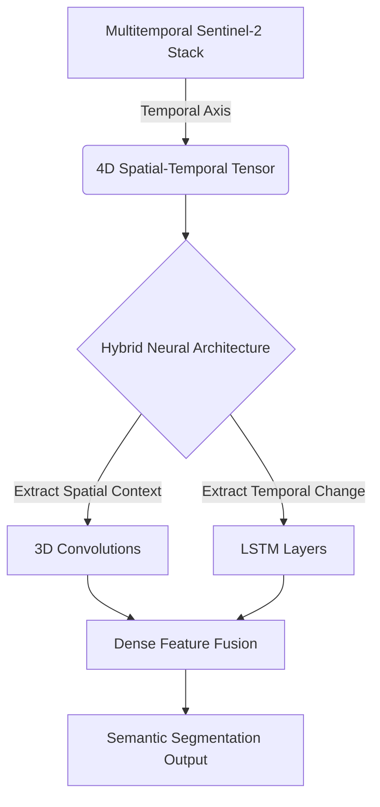

# Singrauli Land-Use Land-Cover Classification: Technical Architecture and Methodological Framework

## 1. Introduction

The systematic categorization of terrestrial characteristics into discrete semantic classes—Land-Use Land-Cover (LULC) classification—is a critical prerequisite for environmental impact assessment, resource management, and urban planning. In the context of the Singrauli district, characterized by vast coal reserves and intensive industrial activity, robust LULC monitoring is imperative.

This manuscript details the methodological framework and technical architecture implemented for classifying high-resolution, multi-spectral Sentinel-2 satellite imagery. The repository bridges two dominant analytical paradigms in contemporary remote sensing:
1. **Classical Machine Learning via Google Earth Engine (GEE):** Utilizing pixel-based Random Forest classifiers operating within a distributed cloud-computing environment for scalable, baseline classification.
2. **Deep Learning via Python and TensorFlow:** Extracting deep spatial hierarchies and contextual features through Convolutional Neural Networks (CNNs) operating on localized $9 \times 9$ and $15 \times 15$ image patches, addressing the limitations of spectral-only models.

## 2. Mathematical Formulation of the Classification Problem

LULC classification is formulated as a supervised statistical learning problem mapping a continuous multidimensional feature space to a discrete set of categorical labels. Let $\mathbf{x}_i \in \mathbb{R}^d$ represent the feature vector for a spatial location $i$, where $d$ denotes the dimensionality of the feature space. Let $y_i \in \mathcal{C}$ be the corresponding categorical label. For the Singrauli dataset, the finite class set $\mathcal{C}$ is defined as:

$$ \mathcal{C} = \{1: \text{Water}, 2: \text{Agriculture}, 3: \text{Settlement}, 4: \text{Mining}, 5: \text{Barren}, 6: \text{Forest}\} $$

The objective is to learn a hypothesis function $f(\cdot; \theta)$, parameterized by learnable weights $\theta$, that assigns a predicted class $\hat{y}_i$ maximizing the posterior probability given the observed features:

$$ \hat{y}_i = \underset{c \in \mathcal{C}}{\mathrm{argmax}} \; P(y_i = c \mid \mathbf{x}_i; \theta) $$

- For the **Random Forest** approach, $\mathbf{x}_i$ is a one-dimensional vector representing the spectral signature of a single, isolated pixel.
- For the **Convolutional Neural Network** approach, the input space is expanded to capture spatial autocorrelation. Thus, $\mathbf{x}_i \in \mathbb{R}^{H \times W \times d}$ becomes a three-dimensional spatial tensor (a patch) of spatial size $H \times W$ centered around the target pixel.

## 3. Data Engineering and Spatial Schematics

### 3.1 Feature Engineering: Spectral Indices
Calculating normalized difference indices injects domain knowledge into the feature space. The Normalized Difference Vegetation Index (NDVI) exploits the physiological property that chlorophyll absorbs visible Red light while cellular structures reflect Near-Infrared (NIR) light.

$$ \text{NDVI} = \frac{\text{NIR} - \text{Red}}{\text{NIR} + \text{Red}} $$

Where $\text{NIR}$ corresponds to Sentinel-2 Band 8 and $\text{Red}$ corresponds to Band 4. The resulting index is bounded $[-1, 1]$.

### 3.2 Spatial Coordinate Transformation (Georeferencing)
To extract a localized tensor for CNN ingestion, a mathematical mapping from geographical coordinates (Longitude/Latitude) to discrete array indices within the GeoTIFF matrix is required. Coordinates must strictly match the Coordinate Reference System (CRS) of the target GeoTIFF.

The affine transformation matrix $A$ defines the linear mapping between pixel coordinates $(col, row)$ and their spatial locations:

$$
\begin{bmatrix}
lon \\
lat \\
1
\end{bmatrix}
=
A
\begin{bmatrix}
col \\
row \\
1
\end{bmatrix}
=
\begin{bmatrix}
s_{lon} & \gamma & lon_0 \\
\gamma' & s_{lat} & lat_0 \\
0 & 0 & 1
\end{bmatrix}
\begin{bmatrix}
col \\
row \\
1
\end{bmatrix}
$$

Where $s_{lon}$ and $s_{lat}$ represent the pixel spatial resolution, and $(lon_0, lat_0)$ denote the spatial coordinates of the image matrix origin.

To compute the array indices $(col, row)$ given a ground truth coordinate $(lon, lat)$, the inverse affine transformation matrix, $A^{-1}$, is applied:

$$
\begin{bmatrix}
col \\
row \\
1
\end{bmatrix}
=
A^{-1}
\begin{bmatrix}
lon \\
lat \\
1
\end{bmatrix}
$$

A multi-dimensional spatial tensor $P$ of size $N \times N$ is then generated by slicing the master image array $I$:

$$ P = I \left[ row - \lfloor \frac{N}{2} \rfloor : row + \lfloor \frac{N}{2} \rfloor + 1, \quad col - \lfloor \frac{N}{2} \rfloor : col + \lfloor \frac{N}{2} \rfloor + 1, \quad : \right] $$

### 3.3 Data Extraction Pipeline

The extraction logic utilizes `rasterio` for memory-efficient dataset handles and implements a `try/except` block during tensor slicing to gracefully discard boundary edge cases or data anomalies.

## 4. Algorithmic Engines

### 4.1 Ensemble Random Forest (GEE)
The Random Forest is a meta-estimator fitting multiple decision tree classifiers on various dataset sub-samples. Each tree recursively partitions the feature space (B2, B3, B4, B8, B11, B12, and derived indices like NDVI, NDWI, NDBI, texture).

A node split is evaluated by its ability to decrease impurity, maximizing Information Gain by minimizing either Gini Impurity ($I_G$) or Information Entropy ($H$):

$$ I_G = 1 - \sum_{c \in \mathcal{C}} (p_c)^2 $$
$$ H = - \sum_{c \in \mathcal{C}} p_c \log_2(p_c) $$

For a target pixel $\mathbf{x}$, the Random Forest aggregates predictions from $T$ independent trees, outputting the statistical mode:
$$ \hat{y} = \underset{c \in \mathcal{C}}{\mathrm{argmax}} \sum_{t=1}^{T} \mathbb{I}(h_t(\mathbf{x}) = c) $$

### 4.2 Convolutional Neural Networks (Python/TensorFlow)
A CNN models non-linear spatial relationships through discrete convolution operations. For a 2D spatial coordinate $(i, j)$, an input feature map $X$, and a learnable kernel $K$ of spatial dimension $m \times m$ with $C$ input channels, the convolution is defined as:

$$ (X * K)_{i,j} = \sum_{c=1}^{C} \sum_{u=0}^{m-1} \sum_{v=0}^{m-1} X_{i+u, j+v, c} \cdot K_{u,v, c} + b $$

This linear operation is followed by a Rectified Linear Unit (ReLU) activation: $f(z) = \max(0, z)$.

Following convolutional and spatial pooling layers, the high-dimensional feature maps are flattened and passed through Dense layers, culminating in a Softmax activation layer:
$$ P(\hat{y} = c \mid \mathbf{x}) = \frac{e^{z_c}}{\sum_{k=1}^{|\mathcal{C}|} e^{z_k}} $$

Network weights are optimized using the Adam optimizer to minimize the Categorical Cross-Entropy Loss:
$$ \mathcal{L} = -\sum_{i=1}^{M} \sum_{c=1}^{|\mathcal{C}|} y_{i,c} \log(\hat{y}_{i,c}) $$

#### CNN Architecture Topology
*Note: The flowchart illustrates the $9 \times 9$ architecture. The $15 \times 15$ variant adheres to identical sequential logic but initiates with a $15 \times 15 \times 11$ input tensor.*

## 5. Statistical Validation and Accuracy Assessment

To achieve scientific validity, a stringent statistical framework assesses model generalization against a hold-out validation dataset.

### 5.1 The Confusion Matrix
For $K$ distinct classes, the Confusion Matrix $M$ is a $K \times K$ array where $M_{i,j}$ represents the absolute frequency of pixels belonging to true class $i$ predicted as class $j$.

### 5.2 Accuracy Metrics
- **Overall Accuracy (OA):** The ratio of correctly classified validation pixels to the total $N$. Susceptible to class imbalance.
  $$ \text{OA} = \frac{\sum_{i=1}^{K} M_{i,i}}{N} $$
- **User's Accuracy (Precision / Commission Error):**
  $$ \text{UA}_i = \frac{M_{i,i}}{\sum_{j=1}^{K} M_{j,i}} $$
- **Producer's Accuracy (Recall / Omission Error):**
  $$ \text{PA}_i = \frac{M_{i,i}}{\sum_{j=1}^{K} M_{i,j}} $$
- **F1-Score:** The harmonic mean of User's and Producer's Accuracy.
  $$ \text{F1}_i = 2 \cdot \frac{\text{UA}_i \cdot \text{PA}_i}{\text{UA}_i + \text{PA}_i} $$
- **Cohen's Kappa Coefficient ($\kappa$):** Adjusts for chance agreement.
  $$ \kappa = \frac{N \sum_{i=1}^{K} M_{i,i} - \sum_{i=1}^{K} (M_{i,+} \cdot M_{+,i})}{N^2 - \sum_{i=1}^{K} (M_{i,+} \cdot M_{+,i})} $$

These metrics are computationally derived using `sklearn.metrics.confusion_matrix` and `sklearn.metrics.cohen_kappa_score`.

## 6. Vectors for Advanced Expansion

To elevate the codebase to the next state-of-the-art benchmark, the following architectural expansions are theoretically defined:

### 6.1 Semantic Segmentation via U-Net Architectures
Transitioning from a patch-based classification CNN to a Fully Convolutional Network (FCN) like U-Net allows for simultaneous prediction across large spatial grids (e.g., $256 \times 256$). This requires optimizing the **Dice Loss** to handle severe class imbalances inherent in terrestrial mapping:

$$ \text{Dice} = \frac{2 |A \cap B|}{|A| + |B|} \quad \implies \quad \mathcal{L}_{\text{Dice}} = 1 - \text{Dice} $$

### 6.2 Spatiotemporal Data Fusion
Modifying the input dimensionality to encompass chronological data ($H \times W \times \text{Bands} \times \text{Time}$) enables phenological analysis.

### 6.3 Algorithmic Hyperparameter Optimization (HPO)
Programmatic integration of Bayesian optimization frameworks (e.g., Optuna) directly into the Keras training loops to autonomously explore the high-dimensional hyperparameter space for optimal convergence.

## 7. Academic References

- Breiman, L. (2001). *Random Forests.* Machine Learning, 45(1), 5-32.
- Gorelick, N., et al. (2017). *Google Earth Engine: Planetary-scale geospatial analysis for everyone.* Remote Sensing of Environment, 202, 18-27.
- LeCun, Y., Bengio, Y., & Hinton, G. (2015). *Deep learning.* Nature, 521(7553), 436-444.
- Sharma, A., et al. (2017). *A patch-based convolutional neural network for remote sensing image classification.* Neural Networks, 95, 19-28.
- Olofsson, P., et al. (2014). *Good practices for estimating area and assessing accuracy of land change.* Remote Sensing of Environment, 148, 42-57.
