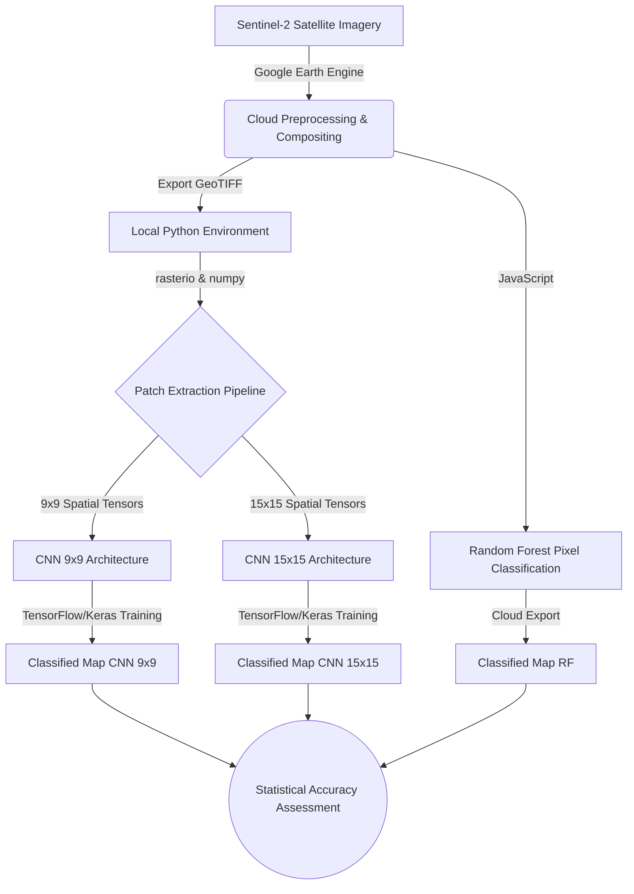

# Chapter 1: The Landscape

Welcome to the Master Technical Manuscript for the Singrauli Land-Use Land-Cover (LULC) Classification project. As your Lead Technical Architect and Research Scientist, I have synthesized this codebase to provide a rigorous, comprehensive, and accessible journey into the intersection of Geoinformatics (GIS) and Machine Learning (ML).

## 1. Core Concept: The "Why"

The Earth's surface is highly dynamic, constantly altered by both anthropogenic activities and natural processes. Land-Use Land-Cover (LULC) classification is the systematic categorization of these physical and functional terrestrial characteristics into discrete semantic classes. In the context of the Singrauli district—a region historically characterized by vast coal reserves, intensive mining operations, and associated heavy industry—continuous and accurate monitoring of these categories is not merely an academic exercise; it is a critical prerequisite for environmental impact assessment, resource management, and sustainable urban planning.

The primary objective of this repository is to demonstrate and evaluate a multi-modal methodological framework for LULC classification using high-resolution, multi-spectral Sentinel-2 satellite imagery. To achieve this, we bridge two dominant analytical paradigms in contemporary remote sensing:

1. **Classical Machine Learning via Google Earth Engine (GEE):** Utilizing pixel-based Random Forest classifiers operating directly within a distributed cloud-computing environment. This represents the traditional, highly scalable standard in the industry.
2. **Deep Learning via Python and TensorFlow:** Extracting deep spatial hierarchies and contextual features through Convolutional Neural Networks (CNNs). By operating on localized $9 \times 9$ and $15 \times 15$ image patches rather than isolated pixels, this approach addresses the fundamental limitations of spectral-only classification.

## 2. Mathematical Foundations: The Classification Problem

At its mathematical core, LULC classification is formulated as a supervised statistical learning problem. The objective is to map a continuous multidimensional feature space (derived from satellite telemetry) to a discrete set of categorical labels.

Let $\mathbf{x}_i \in \mathbb{R}^d$ represent the feature vector for a given spatial location $i$, where $d$ denotes the dimensionality of the feature space (e.g., the number of spectral reflectance bands such as Red, Green, Blue, and Near-Infrared). Let $y_i \in \mathcal{C}$ be the corresponding ground-truth categorical label. For the Singrauli dataset, our finite class set $\mathcal{C}$ is defined as:

$$ \mathcal{C} = \{1: \text{Water}, 2: \text{Agriculture}, 3: \text{Settlement}, 4: \text{Mining}, 5: \text{Barren}, 6: \text{Forest}\} $$

Our overarching goal is to learn a hypothesis function $f(\cdot; \theta)$, parameterized by a set of learnable weights $\theta$, that accurately approximates the true underlying distribution. Formally, we seek to assign a predicted class $\hat{y}_i$ that maximizes the posterior probability given the observed features:

$$ \hat{y}_i = \underset{c \in \mathcal{C}}{\mathrm{argmax}} \; P(y_i = c \mid \mathbf{x}_i; \theta) $$

Where:
- $\hat{y}_i$ is the statistically optimal predicted class label.
- $P(y_i = c \mid \mathbf{x}_i; \theta)$ is the conditional probability of class $c$ given the input feature vector $\mathbf{x}_i$ and the current model parameters $\theta$.

**The Paradigm Shift in Input Dimensionality:**
- For the **Random Forest** approach, $\mathbf{x}_i$ is a one-dimensional vector representing the spectral signature of a *single, isolated pixel*.
- For the **Convolutional Neural Network** approach, the input space is expanded to capture spatial autocorrelation. Thus, $\mathbf{x}_i \in \mathbb{R}^{H \times W \times d}$ becomes a three-dimensional spatial tensor (a patch) of spatial size $H \times W$ (e.g., $9 \times 9$ or $15 \times 15$) centered around the target pixel.

## 3. Logic Workflow: High-Level Architecture

To transform raw electromagnetic reflectance into actionable ecological intelligence, the repository is architected around a robust, five-stage operational pipeline:

1. **Data Acquisition & Compositing (GEE):** Raw Sentinel-2 satellite imagery is ingested, temporally filtered for minimal cloud cover, and composited into a single representative mosaic. Spectral indices are mathematically derived to amplify specific physical features (e.g., vegetation health, moisture).
2. **Data Extraction & Spatial Indexing (Python):** The high-fidelity GeoTIFF imagery is read into local memory using specialized geospatial libraries. Custom Python algorithms perform inverse spatial transformations to slice the continuous geographic raster into thousands of discrete, localized $N \times N$ patches centered precisely on our labeled ground-truth coordinates.
3. **Model Training (GEE & Python):**
   - *The GEE Route:* An ensemble Random Forest classifier is trained and executed entirely on Google's cloud infrastructure, providing a rapid, pixel-based baseline.
   - *The Python Route:* Custom Sequential Convolutional Neural Networks are defined, compiled, and iteratively trained on the extracted spatial tensors locally using TensorFlow and Keras.
4. **Inference and Cartography (Python):** The fully optimized CNN models infer the class probability distribution for every spatial coordinate across the base image array, ultimately synthesizing a newly classified, color-mapped GeoTIFF.
5. **Rigorous Accuracy Assessment:** The model predictions are empirically validated against an independent, hold-out test set. This stage computes stringent statistical metrics—including Confusion Matrices, Kappa coefficients, and F1-scores—to quantify predictive reliability and systemic bias.

## 4. Visual Representations

## 5. Educational Deep-Dive: The "Sorting Legos" Analogy

To conceptualize the profound difference between our two analytical engines, consider the task of sorting a massive pile of mixed, colored Lego bricks spilled across a floor. Your directive is to categorize them by their overarching structure (e.g., a "house," a "lake," a "forest").

**The Pixel-Based Approach (Random Forest):**
Imagine you pick up a single Lego brick, look *only* at its color and immediate shape, and instantly throw it into a categorized bucket. A blue brick? You assume it is "Water." A green brick? You assume "Forest." This method is incredibly fast and mathematically efficient. However, what if that single blue brick is actually part of a blue roof within a sprawling urban Settlement? Because you lacked contextual awareness—you didn't look at the bricks *around* it—you misclassify the structure. This "tunnel vision" is the inherent limitation of the pixel-based Random Forest model.

**The Context-Based Approach (Convolutional Neural Networks):**
Now imagine you employ a magnifying glass to examine a small, localized cluster of bricks (a $9 \times 9$ or $15 \times 15$ grid) before making a decision about the central brick. You see that same blue brick in the middle, but your wider field of view reveals it is surrounded by rigid grey concrete bricks and red brick walls. By analyzing the geometric arrangement and spatial context, your brain correctly deduces, "This is a blue roof in an urban settlement, not a lake." By considering the spatial neighborhood, your classification accuracy increases exponentially. This is the exact mechanism of Convolutional Neural Networks—they process texture, geometry, and spatial hierarchies, rather than relying on spectral color alone.
