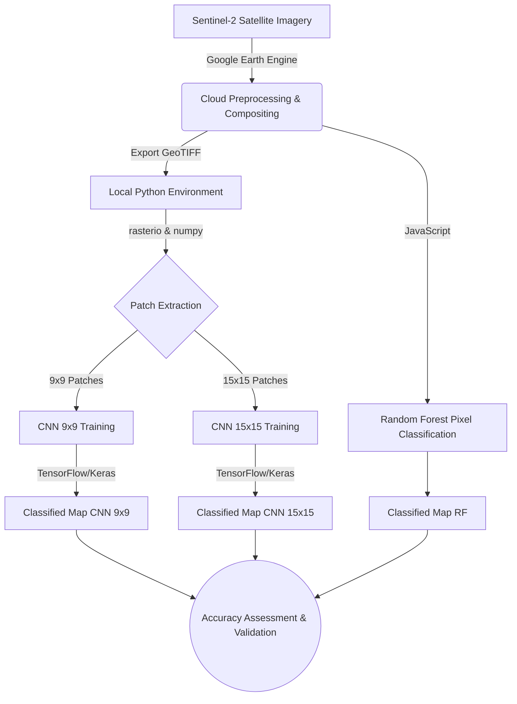

# Chapter 1: The Landscape

Welcome to the Master Technical Manuscript for the Singrauli Land-Use Land-Cover (LULC) Classification project. As your Lead Technical Architect and Research Scientist, I have synthesized this codebase to provide a rigorous yet accessible journey into the intersection of Geoinformatics (GIS) and Machine Learning (ML).

## 1. Core Concept: The "Why"
Land-Use Land-Cover (LULC) classification is the process of categorizing the Earth's surface into discrete classes (e.g., Water, Agriculture, Settlement, Mining, Barren, and Forest). In the context of the Singrauli district—a region rich in coal reserves and heavy industry—monitoring these categories is paramount for environmental assessment and sustainable urban planning.

The primary objective of this repository is to demonstrate a multi-modal approach to LULC classification using high-resolution Sentinel-2 satellite imagery. We bridge two dominant paradigms:
1. **Classical Machine Learning via Google Earth Engine (GEE):** Utilizing pixel-based Random Forest classifiers directly in the cloud.
2. **Deep Learning via Python and TensorFlow:** Extracting spatial context through Convolutional Neural Networks (CNNs) operating on $9 \times 9$ and $15 \times 15$ image patches.

## 2. Mathematical Foundations: The Classification Problem

At its core, LULC classification is a supervised learning problem mapping spectral data to categorical labels.

Let $\mathbf{x}_i \in \mathbb{R}^d$ represent the feature vector for a given spatial location $i$, where $d$ is the number of spectral bands (e.g., Red, Green, Blue, Near-Infrared). Let $y_i \in \mathcal{C}$ be the corresponding categorical label, where our class set is defined as:
$$ \mathcal{C} = \{1: \text{Water}, 2: \text{Agriculture}, 3: \text{Settlement}, 4: \text{Mining}, 5: \text{Barren}, 6: \text{Forest}\} $$

Our goal is to learn a hypothesis function $f(\cdot; \theta)$ parameterized by $\theta$ such that:
$$ \hat{y}_i = \underset{c \in \mathcal{C}}{\mathrm{argmax}} \; P(y_i = c \mid \mathbf{x}_i; \theta) $$

Where:
- $\hat{y}_i$ is the predicted class label.
- $P(y_i = c \mid \mathbf{x}_i; \theta)$ is the conditional probability of class $c$ given the input $\mathbf{x}_i$.

For the **Random Forest** approach, $\mathbf{x}_i$ is a single pixel's spectral signature. For the **CNN** approach, $\mathbf{x}_i \in \mathbb{R}^{H \times W \times d}$ is a spatial patch of size $H \times W$ (e.g., $9 \times 9$ or $15 \times 15$) centered around the pixel, incorporating critical spatial context.

## 3. Logic Workflow: High-Level Architecture

The repository is structured around a five-stage pipeline:

1. **Data Acquisition (GEE):** Sentinel-2 satellite imagery is filtered for cloud cover and composited. Spectral indices are calculated to enhance specific features. Ground truth points are also processed here.
2. **Data Extraction & Spatial Indexing (Python):** The exported GeoTIFF imagery is read into memory. Python scripts slice the continuous spatial data into discrete patches ($9 \times 9$ and $15 \times 15$) centered on our labeled points, creating `.npz` datasets.
3. **Model Training (GEE & Python):**
   - *GEE Route:* A Random Forest classifier is trained and executed on the cloud platform.
   - *Python Route:* Custom Sequential CNN models are trained on the extracted patches using TensorFlow/Keras.
4. **Prediction (Python):** The trained CNN models infer the class of every pixel in the base image, producing a new classified GeoTIFF.
5. **Accuracy Assessment:** The predictions are compared against an independent test set of ground truth labels to compute statistical metrics like Confusion Matrices, Kappa coefficients, and F1-scores.

## 4. Visual Representations

## 5. Educational Deep-Dive: The "Sorting Legos" Analogy

If you are new to ML and GIS, think of satellite imagery as a giant box of mixed, colored Lego bricks spilled onto a floor. Your job is to sort them by type (Water, Forest, Settlement, etc.).

**The Pixel-Based Approach (Random Forest):**
Imagine you pick up a single Lego brick, look *only* at its color and shape, and immediately throw it into a bucket. A blue brick? Probably water. A green brick? Probably forest. This is fast, but what if a blue brick is actually a blue roof in a city? Because you didn't look at the bricks *around* it, you might misclassify it. This is how the Google Earth Engine Random Forest model works—it evaluates one pixel at a time.

**The Context-Based Approach (Convolutional Neural Networks):**
Now imagine you use a magnifying glass to look at a small cluster of bricks (a $9 \times 9$ or $15 \times 15$ grid) before making a decision about the center brick. You see a blue brick in the middle, but it's surrounded by grey and red bricks forming a grid pattern. You realize, "Ah! This is a blue roof in a residential settlement, not a lake." By considering the spatial context, your classification becomes much more accurate. This is the power of Convolutional Neural Networks (CNNs). They don't just see color (spectral data); they see texture and shape (spatial data).
