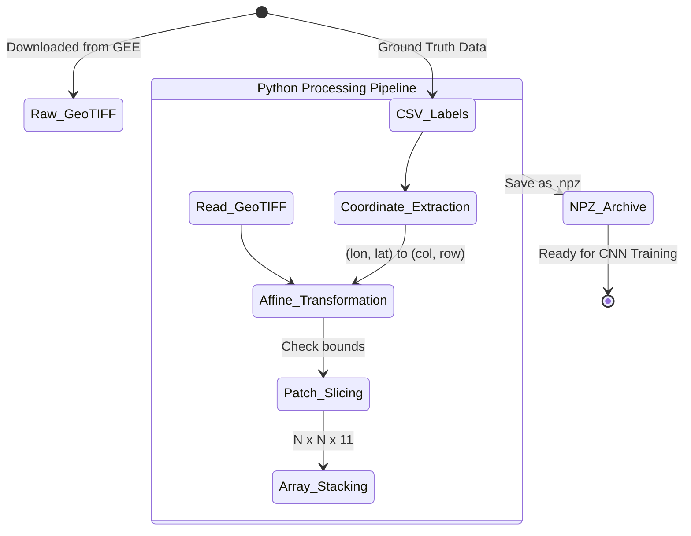

# Chapter 2: Data Schematics

Before building powerful predictive engines, we must first architect a robust data pipeline. This chapter details the transition from raw satellite telemetry to structured, machine-readable datasets suitable for both pixel-based and spatial modeling.

## 1. Core Concept: The "Why"
Raw satellite imagery is essentially a massive multi-dimensional matrix of reflectance values. A single Sentinel-2 image covers thousands of square kilometers across multiple electromagnetic bands.

However, deep learning models like CNNs cannot consume a gigabyte-sized image in one go. Furthermore, they require *labeled examples* to learn. Therefore, our primary data processing task is twofold:
1. **Feature Engineering:** Calculating spectral indices to make hidden patterns visible to algorithms.
2. **Spatial Indexing & Extraction:** Slicing the massive continuous raster image into thousands of localized "patches" centered around ground-truth coordinates, transforming geospatial data into standard ML tensors.

## 2. Mathematical Foundations: Spectral Indices & Spatial Extraction

### Spectral Indices
To aid the classification, especially for the Random Forest model in Google Earth Engine, we compute normalized difference indices. The most common is the Normalized Difference Vegetation Index (NDVI), which highlights living vegetation.

$$ \text{NDVI} = \frac{\text{NIR} - \text{Red}}{\text{NIR} + \text{Red}} $$
Where:
- $\text{NIR}$ is the Near-Infrared reflectance (Band 8 in Sentinel-2).
- $\text{Red}$ is the visible Red reflectance (Band 4 in Sentinel-2).

### Spatial Coordinate Transformation
To extract a patch for our CNN, we must map real-world geographical coordinates (Longitude/Latitude) to array indices in the GeoTIFF matrix. Let $(lon, lat)$ be a coordinate in the EPSG:4326 coordinate reference system.

The affine transformation matrix $A$ defines the relationship between pixel coordinates $(col, row)$ and spatial coordinates:

$$
\begin{bmatrix}
lon \\
lat \\
1
\end{bmatrix}
=
A
\begin{bmatrix}
col \\
row \\
1
\end{bmatrix}
=
\begin{bmatrix}
s_{lon} & 0 & lon_0 \\
0 & s_{lat} & lat_0 \\
0 & 0 & 1
\end{bmatrix}
\begin{bmatrix}
col \\
row \\
1
\end{bmatrix}
$$

Where:
- $s_{lon}$ and $s_{lat}$ are the pixel sizes (resolution) in map units.
- $(lon_0, lat_0)$ are the coordinates of the top-left corner pixel.

To extract the pixel indices $(col, row)$ given a ground truth coordinate $(lon, lat)$, we apply the inverse transformation $A^{-1}$:

$$
\begin{bmatrix}
col \\
row \\
1
\end{bmatrix}
=
A^{-1}
\begin{bmatrix}
lon \\
lat \\
1
\end{bmatrix}
$$

Once the central pixel $(col, row)$ is found, a spatial patch of size $N \times N$ is extracted by slicing the multi-band array $I$:
$$ P = I \left[ row - \lfloor \frac{N}{2} \rfloor : row + \lfloor \frac{N}{2} \rfloor + 1, \quad col - \lfloor \frac{N}{2} \rfloor : col + \lfloor \frac{N}{2} \rfloor + 1, \quad : \right] $$

## 3. Logic Workflow: From Cloud to Tensors

The `Data_Extraction.ipynb` script is the heart of this chapter. Here is how the logic flows:

1. **Environment Setup:** Mount Google Drive to access the massive `Singrauli_Merged_Image.tif` and the labeled CSV file containing known coordinates and their LULC classes.
2. **Library Ingestion:** Utilize `rasterio` to open the GeoTIFF without loading the entire multi-gigabyte file into RAM (lazy loading).
3. **Coordinate Parsing:** Read the CSV file using `pandas`. Extract lists of longitudes, latitudes, and labels.
4. **Vectorized Extraction:**
   - Loop through the coordinates. For every point, use `rasterio.index(lon, lat)` to perform the mathematical inverse affine transformation described above.
   - Slice the NumPy array to grab a $9 \times 9$ or $15 \times 15$ pixel region across all 11 spectral bands.
5. **Quality Assurance:** If a coordinate falls too close to the edge of the image (meaning a full $9 \times 9$ patch cannot be formed), it is discarded to prevent out-of-bounds errors.
6. **Serialization:** The resulting array of patches (Shape: `[Num_Samples, N, N, 11]`) and their corresponding labels (Shape: `[Num_Samples]`) are saved as compressed NumPy archives (`.npz`).

## 4. Visual Representations: Data Flow State Diagram

## 5. Educational Deep-Dive: The "Cookie Cutter" Analogy

Imagine you have a gigantic, multi-layered cake representing our satellite image. Each layer of the cake is a different flavor (representing the 11 different spectral bands like Red, Blue, Near-Infrared).

You also have a map with X marks showing where specific ingredients are buried in the cake (these are our CSV ground-truth coordinates).

You can't shove the whole cake into an oven (our Deep Learning model) all at once; it's simply too big. Instead, you need to bake smaller, manageable pieces.

The data extraction script acts like a square **cookie cutter**.
1. You look at your map and find an X (Coordinate parsing).
2. You figure out exactly where that X is on the physical cake (Affine Transformation).
3. You press your $9 \times 9$ square cookie cutter straight down through *all 11 layers* of the cake (Patch Slicing).
4. You carefully pull out that multi-layered square piece and place it in a Tupperware box (Saving to `.npz`).

By repeating this for every X on the map, you create a neat box of identically sized, multi-layered cake samples, perfectly prepped for the model to "taste" and learn from!
