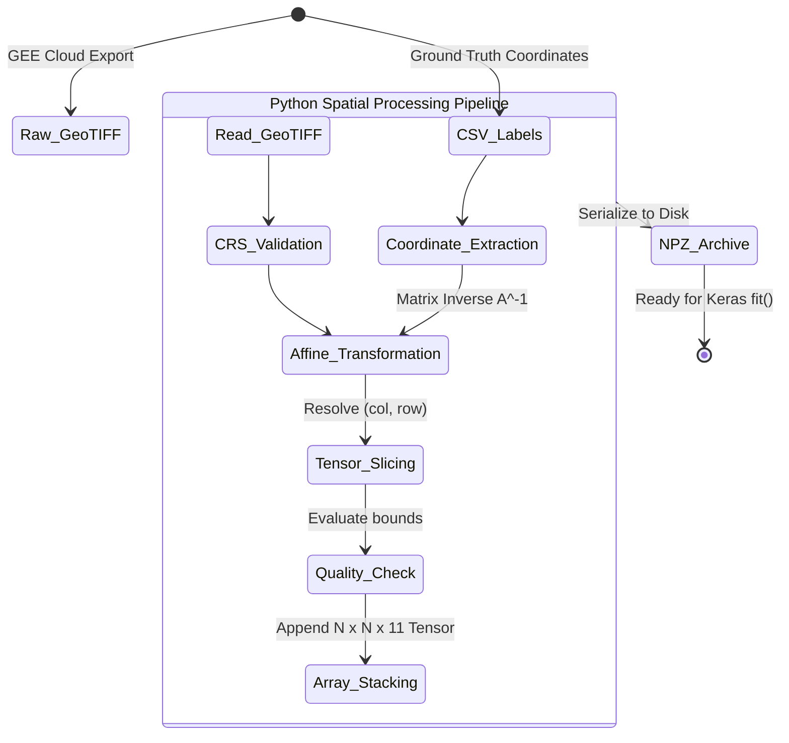

# Chapter 2: Data Schematics

Before architecting powerful predictive models, a Data Scientist must first engineer a highly rigorous data pipeline. The quality of a machine learning model is strictly upper-bounded by the quality of the data it ingests. This chapter details the complex transition from raw satellite telemetry—a massive, multi-dimensional matrix of reflectance values—into structured, mathematically normalized datasets suitable for deep learning.

## 1. Core Concept: The "Why"

Raw Sentinel-2 imagery covers thousands of square kilometers across multiple electromagnetic bands, resulting in files that often exceed several gigabytes. Deep learning models, particularly Convolutional Neural Networks, cannot practically consume an entire gigabyte-sized image array in a single forward pass due to GPU memory constraints. Furthermore, supervised learning requires structured pairs of inputs and corresponding *labels* to calculate loss gradients.

Therefore, our primary geospatial data processing task is twofold:
1. **Feature Engineering & Enhancement:** Deriving new mathematical variables (spectral indices) from the raw optical bands to make hidden ecological patterns explicitly visible to the learning algorithm.
2. **Spatial Indexing & Matrix Slicing:** Transforming the continuous, geographically referenced raster matrix into thousands of discrete, localized "patches" centered precisely around validated ground-truth coordinates. This step effectively bridges the gap between traditional GIS software and standard ML tensor operations.

## 2. Mathematical Foundations: Spectral Indices & Affine Geometry

### Feature Engineering: Spectral Indices
While models can learn from raw reflectance data, calculating normalized difference indices acts as a powerful heuristic, injecting domain knowledge directly into the feature space. The most ubiquitous in vegetation analysis is the Normalized Difference Vegetation Index (NDVI).

NDVI mathematically exploits the physiological fact that healthy chlorophyll strongly absorbs visible Red light while the cellular structure of leaves strongly reflects Near-Infrared (NIR) light.

$$ \text{NDVI} = \frac{\text{NIR} - \text{Red}}{\text{NIR} + \text{Red}} $$

Where, for the Sentinel-2 multispectral instrument:
- $\text{NIR}$ corresponds to Band 8 (central wavelength $\approx 842$ nm).
- $\text{Red}$ corresponds to Band 4 (central wavelength $\approx 665$ nm).

The resulting index is bounded $[-1, 1]$, where values closer to $1$ indicate dense, healthy vegetation, and values near or below $0$ indicate water or barren surfaces.

### Spatial Coordinate Transformation (Georeferencing)
To extract a localized patch for our CNN, we must establish a mathematical mapping from real-world geographical coordinates (Longitude and Latitude) to discrete row and column indices within the GeoTIFF's underlying NumPy matrix.

Let $(lon, lat)$ be a spatial coordinate that strictly matches the Coordinate Reference System (CRS) of the target GeoTIFF (e.g., a specific UTM projection). If the ground-truth CSV points are stored in standard EPSG:4326 (WGS 84), they must first be reprojected to the raster's specific CRS to ensure mathematical validity.

The affine transformation matrix $A$ defines the linear mapping between pixel coordinates $(col, row)$ and their spatial locations. Using homogenous coordinates to allow for translation:

$$
\begin{bmatrix}
lon \\
lat \\
1
\end{bmatrix}
=
A
\begin{bmatrix}
col \\
row \\
1
\end{bmatrix}
=
\begin{bmatrix}
s_{lon} & \gamma & lon_0 \\
\gamma' & s_{lat} & lat_0 \\
0 & 0 & 1
\end{bmatrix}
\begin{bmatrix}
col \\
row \\
1
\end{bmatrix}
$$

Where:
- $s_{lon}$ and $s_{lat}$ represent the pixel spatial resolution (scale) in map units.
- $(lon_0, lat_0)$ denote the exact spatial coordinates of the top-left corner of the image matrix.
- $\gamma$ and $\gamma'$ represent rotation and shearing parameters (typically $0$ for standard satellite imagery).

To computationally extract the array indices $(col, row)$ given a ground truth coordinate $(lon, lat)$, the system applies the inverse of the affine transformation matrix, $A^{-1}$:

$$
\begin{bmatrix}
col \\
row \\
1
\end{bmatrix}
=
A^{-1}
\begin{bmatrix}
lon \\
lat \\
1
\end{bmatrix}
$$

Once the central integer pixel indices $(col, row)$ are resolved, a multi-dimensional spatial tensor $P$ of size $N \times N$ is generated by slicing the master image array $I$:

$$ P = I \left[ row - \lfloor \frac{N}{2} \rfloor : row + \lfloor \frac{N}{2} \rfloor + 1, \quad col - \lfloor \frac{N}{2} \rfloor : col + \lfloor \frac{N}{2} \rfloor + 1, \quad : \right] $$

## 3. Logic Workflow: From Cloud Coordinates to ML Tensors

The `Data_Extraction.ipynb` script orchestrates this complex mathematical extraction. The logical workflow is structured as follows:

1. **Environment Initialization:** Mount the Google Drive filesystem to access the heavy `Singrauli_Merged_Image.tif` and the labeled CSV file containing ground-truth coordinates.
2. **Lazy Loading:** Utilize the `rasterio` library to open the GeoTIFF. Crucially, the image is read into a dataset handle rather than fully loaded into RAM, preventing catastrophic memory overflow.
3. **Coordinate Parsing:** Ingest the CSV file using `pandas`. Extract vectors of longitudes, latitudes, and their corresponding categorical LULC labels.
4. **Vectorized Extraction Loop:**
   - Iterate through the coordinate vectors. For each spatial point, execute `rasterio.index(lon, lat)` to computationally perform the inverse affine transformation ($A^{-1}$).
   - Slice the underlying NumPy array to extract a continuous $9 \times 9$ or $15 \times 15$ spatial region across all 11 optical bands.
5. **Quality Assurance & Exception Handling:** The extraction logic is wrapped in a `try/except` block. If a coordinate falls too close to the image boundary (rendering a full $N \times N$ patch impossible), or if anomalous data is encountered during the matrix slice, the exception is caught and the coordinate is gracefully discarded. Monitoring these dropped points is essential for data integrity audits.
6. **Serialization:** The resulting multi-dimensional tensor of patches (Shape: `[Num_Samples, N, N, 11]`) and the corresponding target vector (Shape: `[Num_Samples]`) are persisted to disk as highly compressed NumPy archives (`.npz`), ready for immediate ingestion by TensorFlow.

## 4. Visual Representations: Data Flow State Diagram

## 5. Educational Deep-Dive: The "Cookie Cutter" Analogy

To grasp the complexities of spatial data extraction, imagine you have an enormous, multi-layered cake representing our satellite image. Each distinct layer of the cake is baked with a different flavor, representing the 11 different spectral bands (Red, Blue, Near-Infrared, etc.).

You also possess a treasure map marked with specific "X"s indicating where rare ingredients are hidden inside the cake (these "X"s represent our CSV ground-truth coordinates).

You cannot shove the entire multi-gigabyte cake into your oven (our Deep Learning model) all at once; it is computationally impossible. Instead, you must bake smaller, uniform pieces.

The Python data extraction script acts precisely like a high-tech, square **cookie cutter**.
1. You look at your map and pinpoint an "X" (Coordinate parsing).
2. You calculate exactly where that "X" maps to the physical cake on your table (This is the Affine Transformation).
3. You press your $9 \times 9$ square cookie cutter straight down, slicing perfectly through *all 11 layers* of the cake simultaneously (Tensor Slicing).
4. You carefully extract that multi-layered square block and place it in a specialized storage box (Saving to `.npz`).

By methodically repeating this process for every "X" on your map, you transform one massive, unmanageable cake into a neatly organized box of identically sized, multi-layered samples, perfectly prepared for the neural network to consume and learn from.