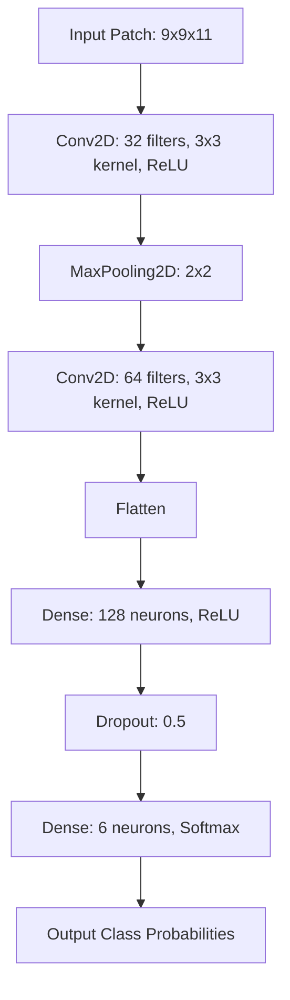

# Chapter 3: The Engine

With our data neatly preprocessed and mathematically framed, we now delve into the algorithms that perform the heavy lifting. This chapter explores the two distinct "engines" driving our LULC classification: the Classical Random Forest (RF) algorithm in Google Earth Engine, and the Deep Convolutional Neural Networks (CNNs) trained locally.

## 1. Core Concept: The "Why"
Why use two different engines?
- **Random Forest** is a robust, interpretable, and computationally light algorithm. It relies solely on the spectral signature (color/reflectance) of an individual pixel. It struggles, however, with "salt-and-pepper" noise—classifying a tiny dark shadow in a city as a water body.
- **Convolutional Neural Networks (CNNs)** are complex and require heavy computation. However, they extract *spatial hierarchies*. They don't just see a dark pixel; they see a dark pixel surrounded by concrete, thereby correctly inferring it is a shadow and not a lake. We train two variations ($9 \times 9$ and $15 \times 15$ input shapes) to test how much spatial context yields the best performance without blurring boundaries.

## 2. Mathematical Foundations

### The Random Forest (RF) Engine
Random Forest is an ensemble of Decision Trees. Each tree partitions the feature space (specific spectral bands like B2, B3, B4, B8, B11, B12, along with calculated indices like NDVI, NDWI, NDBI, and texture) using rules that maximize information gain.

The split at a node is determined by minimizing Impurity, often measured by Gini Impurity or Entropy. Let $p_c$ be the proportion of training pixels belonging to class $c$ in a given node. The Entropy $H$ is:
$$ H = - \sum_{c \in \mathcal{C}} p_c \log_2(p_c) $$

For a pixel with feature vector $\mathbf{x}$, the Random Forest predicts the class by majority vote among $T$ trees:
$$ \hat{y} = \underset{c \in \mathcal{C}}{\mathrm{argmax}} \sum_{t=1}^{T} \mathbb{I}(h_t(\mathbf{x}) = c) $$
Where $h_t(\mathbf{x})$ is the prediction of the $t$-th decision tree, and $\mathbb{I}$ is the indicator function.

### The Convolutional Neural Network (CNN) Engine
A CNN operates via convolution operations. A kernel (a small matrix of weights) slides across our $N \times N \times 11$ patch, performing dot products to extract features (like edges, textures, and patterns).

For a 2D spatial position $(i, j)$, an input tensor $X$, and a kernel $K$ of size $m \times m$ with $C$ input channels, the convolution operation is defined as:
$$ (X * K)_{i,j} = \sum_{c=1}^{C} \sum_{u=0}^{m-1} \sum_{v=0}^{m-1} X_{i+u, j+v, c} \cdot K_{u,v, c} $$

Following convolutions, non-linear activation (typically ReLU) is applied: $f(x) = \max(0, x)$.

Finally, the network flattens the extracted features into a 1D vector and passes them through a fully connected (Dense) layer with a Softmax activation to output class probabilities:
$$ P(\hat{y} = c \mid \mathbf{x}) = \frac{e^{z_c}}{\sum_{k=1}^{|\mathcal{C}|} e^{z_k}} $$
Where $z_c$ is the raw logit score for class $c$ output by the final Dense layer.

The network is optimized by minimizing Categorical Cross-Entropy Loss:
$$ L = -\sum_{i=1}^{M} \sum_{c=1}^{|\mathcal{C}|} y_{i,c} \log(\hat{y}_{i,c}) $$
Where $y_{i,c}$ is 1 if the true class of sample $i$ is $c$, and 0 otherwise.

## 3. Logic Workflow

### GEE Workflow (Random Forest)
1. Initialize the Random Forest classifier (`ee.Classifier.smileRandomForest`).
2. Sample the composite image at the locations of the training feature collection.
3. Train the classifier on the extracted spectral properties.
4. Call `.classify()` to predict over the entire geographical region.

### Python Workflow (CNNs)
1. **Data Loading & Splitting:** Load `.npz` files and use `train_test_split` to create training and validation sets.
2. **Architecture Definition:** Build a Keras `Sequential` model.
   - Add `Conv2D` layers to extract features.
   - Add `MaxPooling2D` to downsample and retain dominant features.
   - `Flatten` the output into a 1D vector.
   - Add `Dense` layers, finishing with a 6-node Softmax layer.
3. **Compilation:** Compile using the `Adam` optimizer and `categorical_crossentropy` loss.
4. **Training:** Fit the model over multiple epochs, utilizing `EarlyStopping` to prevent overfitting.
5. **Inference (Prediction):** Iterate over the base GeoTIFF row-by-row, extract patches on-the-fly, and use `model.predict()` to assign a class to every pixel, generating a new `.tif` file.

## 4. Visual Representations: CNN Architecture

*Note: The diagram below illustrates the $9 \times 9$ architecture. The $15 \times 15$ architecture follows the same sequential logic, but starts with a $15 \times 15 \times 11$ input patch and maintains a correspondingly larger spatial dimension through the convolutional layers before flattening.*

## 5. Educational Deep-Dive: The "Detective vs. Security Camera" Analogy

**Random Forest is the Security Camera:**
Imagine a security camera at a factory looking straight down at an assembly line. It evaluates every item individually as it passes by. "It's shiny and metallic—must be a car part." "It's soft and red—must be an apple." It is fast and efficient but has tunnel vision. It only knows what it sees in that exact coordinate space at that exact moment.

**The CNN is the Detective:**
A CNN is like an investigative detective. When evaluating an object on the ground, the detective doesn't just look at the object itself; they look at the entire crime scene (the *patch*). If the detective sees a shiny metallic object (which the camera called a car part), but notices it's surrounded by sand and sea shells, the detective uses that spatial context to correctly deduce it's an abandoned tin can on a beach, not a car part. The layers of the CNN (Conv2D and MaxPooling) are the deductive reasoning steps the detective uses to piece the scene together.
