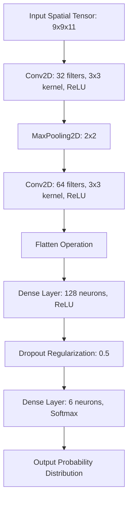

# Chapter 3: The Engine

With our data pipeline cleanly extracting and normalizing both spectral and spatial features, we now turn our focus to the algorithmic core. This chapter rigorously details the two distinct mathematical engines driving our Land-Use Land-Cover classification: the ensemble Random Forest algorithm executed via Google Earth Engine, and the deep Convolutional Neural Networks (CNNs) orchestrated in Python.

## 1. Core Concept: The "Why"

Why design a multi-modal approach utilizing two fundamentally different algorithms?

- **Random Forest (RF)** is a highly resilient, interpretable, and computationally lightweight algorithm. Because it evaluates the feature vector of a single pixel independently, it scales exceptionally well across distributed cloud architectures like GEE. However, this pixel-independence is its greatest flaw; it often generates "salt-and-pepper" noise, misclassifying a single dark shadow on a concrete building as a water body because it lacks situational awareness.
- **Convolutional Neural Networks (CNNs)** are mathematically complex and computationally demanding. However, they excel at extracting *hierarchical spatial features*. A CNN evaluates a pixel by looking at its neighborhood. It perceives not just a dark pixel, but a dark pixel surrounded by geometric concrete patterns, correctly deducing it is an urban shadow rather than a lake. We empirically test two spatial receptive fields ($9 \times 9$ and $15 \times 15$) to find the optimal balance between providing sufficient context and blurring distinct class boundaries.

## 2. Mathematical Foundations

### The Random Forest (RF) Engine
The Random Forest is a meta-estimator that fits a multitude of decision tree classifiers on various sub-samples of the dataset. Each individual decision tree recursively partitions the feature space (comprising specific spectral bands like B2, B3, B4, B8, B11, B12, and derived indices like NDVI) to isolate classes.

A node split is mathematically evaluated by its ability to decrease impurity. Let $p_c$ be the proportion of training samples belonging to class $c$ at a given node. The optimal split maximizes Information Gain, which is calculated by minimizing either the Gini Impurity ($I_G$) or Information Entropy ($H$):

**Gini Impurity:**
$$ I_G = 1 - \sum_{c \in \mathcal{C}} (p_c)^2 $$

**Information Entropy:**
$$ H = - \sum_{c \in \mathcal{C}} p_c \log_2(p_c) $$

For an unknown target pixel represented by feature vector $\mathbf{x}$, the Random Forest aggregates the predictions of $T$ independent trees, outputting the statistical mode (majority vote):
$$ \hat{y} = \underset{c \in \mathcal{C}}{\mathrm{argmax}} \sum_{t=1}^{T} \mathbb{I}(h_t(\mathbf{x}) = c) $$
Where $h_t(\mathbf{x})$ is the discrete classification from the $t$-th tree, and $\mathbb{I}$ is the indicator function.

### The Convolutional Neural Network (CNN) Engine
A CNN models non-linear spatial relationships through discrete convolution operations. A learnable filter (or kernel) slides across the $N \times N \times d$ input tensor, computing dot products to map spatial hierarchies (from basic edges to complex textures).

For a given 2D spatial coordinate $(i, j)$, an input feature map $X$, and a kernel $K$ of spatial dimension $m \times m$ with $C$ input channels, the convolution is defined as:
$$ (X * K)_{i,j} = \sum_{c=1}^{C} \sum_{u=0}^{m-1} \sum_{v=0}^{m-1} X_{i+u, j+v, c} \cdot K_{u,v, c} + b $$
Where $b$ is a learned bias term.

This linear operation is immediately followed by a non-linear activation function, universally the Rectified Linear Unit (ReLU), which mitigates the vanishing gradient problem:
$$ f(z) = \max(0, z) $$

Following cascading convolutional and spatial pooling layers, the network flattens the high-dimensional feature maps into a 1D vector. This vector is passed through fully connected Dense layers, culminating in a Softmax activation layer that outputs a normalized probability distribution across the target classes:
$$ P(\hat{y} = c \mid \mathbf{x}) = \frac{e^{z_c}}{\sum_{k=1}^{|\mathcal{C}|} e^{z_k}} $$
Where $z_c$ is the raw logit computed by the final layer for class $c$.

The network weights are iteratively optimized using the Adam optimizer to minimize the Categorical Cross-Entropy Loss:
$$ \mathcal{L} = -\sum_{i=1}^{M} \sum_{c=1}^{|\mathcal{C}|} y_{i,c} \log(\hat{y}_{i,c}) $$
Where $y_{i,c} \in \{0,1\}$ is the one-hot encoded ground truth for sample $i$, and $\hat{y}_{i,c}$ is the model's predicted probability.

## 3. Logic Workflow

### The GEE Cloud Workflow (Random Forest)
1. **Instantiation:** Initialize the algorithm using `ee.Classifier.smileRandomForest`, specifying the number of trees.
2. **Feature Extraction:** Sample the composite satellite image at the exact geographic coordinates defined by the training FeatureCollection.
3. **Model Fitting:** Train the ensemble classifier on the extracted spectral signatures.
4. **Cloud Inference:** Execute the `.classify()` method to apply the learned ruleset across the entire regional geometry, exporting the result.

### The Python Local Workflow (CNNs)
1. **Data Ingestion & Partitioning:** Load the serialized `.npz` tensors. Utilize `sklearn.model_selection.train_test_split` to rigorously partition the data into training and validation sets to monitor generalization.
2. **Topological Definition:** Construct a Keras `Sequential` graph.
   - Stack `Conv2D` layers to map spatial features.
   - Insert `MaxPooling2D` layers to aggressively downsample the spatial dimensions, providing translation invariance.
   - Apply a `Flatten` operation.
   - Conclude with `Dense` layers, terminating in a 6-node Softmax layer.
3. **Compilation:** Attach the `Adam` optimizer and `categorical_crossentropy` loss function to the graph.
4. **Iterative Optimization:** Fit the model over multiple epochs. Implement an `EarlyStopping` callback monitoring `val_loss` to dynamically halt training and prevent catastrophic overfitting.
5. **Spatial Inference:** To classify the map, a sliding window iterates over the base GeoTIFF, dynamically extracting tensors and calling `model.predict()` to assign a spatial classification to every coordinate.

## 4. Visual Representations: CNN Architecture

*Note: The flowchart below illustrates the specific topology of the $9 \times 9$ architecture. The $15 \times 15$ variant adheres to the exact same sequential logic, but initiates with a larger $15 \times 15 \times 11$ input tensor, thereby maintaining larger spatial dimensions deeper into the convolutional cascade before flattening.*

## 5. Educational Deep-Dive: The "Detective vs. Security Camera" Analogy

To intuitively grasp why these algorithms perform differently, consider them as two distinct types of observers analyzing a complex scene.

**Random Forest is the Fixed Security Camera:**
Imagine a low-resolution security camera pointing straight down at an assembly line. It evaluates every item individually as it passes directly under the lens. "The object is shiny and metallic—it must be a car part." "The object is soft and red—it must be an apple." The camera is incredibly fast and processes millions of items a day. However, it suffers from severe tunnel vision; it only knows what it sees in that exact coordinate space at that exact millisecond.

**The Convolutional Neural Network is the Forensic Detective:**
Conversely, a CNN acts like an investigative detective evaluating a crime scene. When analyzing an object on the ground, the detective doesn't just look at the object itself; they analyze the entire surrounding perimeter (the *spatial patch*). If the detective sees a shiny metallic object (which the camera quickly labeled a car part), but notices it is surrounded by sand, sea shells, and ocean water, the detective uses that spatial context to correctly deduce it is an abandoned tin can on a beach.

The stacked `Conv2D` and `MaxPooling` layers within the neural network are the mathematical equivalent of the deductive reasoning steps the detective uses to piece the surrounding context together, resulting in a vastly more intelligent and accurate conclusion.