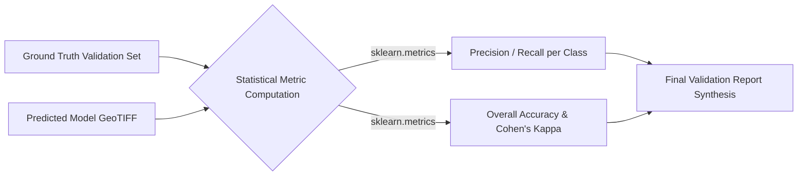

# Chapter 4: Results & Interpretation

Executing complex mathematical models and generating colorized classification maps is only the midpoint of the scientific lifecycle. A rigorous Data Scientist must empirically validate those predictions. This chapter deconstructs the statistical framework known as Accuracy Assessment, explaining how we mathematically and visually evaluate which algorithmic "engine" truly generalizes best to unseen terrestrial data.

## 1. Core Concept: The "Why"

In the domain of remote sensing, subjective visual inspection is notoriously deceptive. A synthesized LULC map might "look" highly realistic to the human eye, yet be fundamentally flawed due to systemic algorithmic bias (e.g., heavily over-predicting the majority class while ignoring minority classes).

To achieve scientific validity, we rely on a strict statistical framework. By comparing a stratified random sample of the model's spatial predictions against a meticulously validated "Ground Truth" dataset (data explicitly held out and never seen during the training phase), we construct a Confusion Matrix. From this fundamental matrix, we derive a suite of standardized mathematical metrics that explicitly quantify not merely *whether* the model is accurate, but precisely *where* and *how* it fails.

## 2. Mathematical Foundations: Accuracy Metrics

### The Confusion Matrix (Error Matrix)
The bedrock of accuracy assessment is the Confusion Matrix $M$. For a classification task with $K$ distinct classes, $M$ is a square $K \times K$ matrix. Each individual cell $M_{i,j}$ represents the absolute frequency of pixels belonging to the true ground class $i$ that were algorithmically predicted as class $j$. The main diagonal ($M_{i,i}$) represents correct predictions, while all off-diagonal elements represent specific types of misclassification.

### Overall Accuracy (OA)
Overall Accuracy is the most intuitive metric: the ratio of correctly classified validation pixels to the total number of validation pixels $N$.
$$ \text{OA} = \frac{\sum_{i=1}^{K} M_{i,i}}{N} $$
*Limitation:* OA is highly susceptible to class imbalance. If 90% of a region is Forest, a model that blindly guesses "Forest" for everything achieves 90% OA but is practically useless.

### Class-Specific Metrics: Precision and Recall
To understand class-level performance, we compute metrics from the rows and columns of the matrix.

- **User's Accuracy (Precision for Class $i$):** Also known as the *Commission Error* rate. If the model predicts a pixel is "Forest," what is the statistical probability that the pixel is *actually* Forest in reality?
  $$ \text{UA}_i = \frac{M_{i,i}}{\sum_{j=1}^{K} M_{j,i}} $$

- **Producer's Accuracy (Recall for Class $i$):** Also known as the *Omission Error* rate. Out of all the actual, ground-truth Forest pixels in the validation set, what proportion did the model successfully detect?
  $$ \text{PA}_i = \frac{M_{i,i}}{\sum_{j=1}^{K} M_{i,j}} $$

### The F1-Score
The F1-Score calculates the harmonic mean of User's Accuracy (Precision) and Producer's Accuracy (Recall). It provides a robust, single-value metric for class-specific performance that severely penalizes extreme disparities between Precision and Recall.
$$ \text{F1}_i = 2 \cdot \frac{\text{UA}_i \cdot \text{PA}_i}{\text{UA}_i + \text{PA}_i} $$

### The Kappa Coefficient ($\kappa$)
The Kappa statistic is a highly rigorous metric that measures the agreement between the model's classification and the ground truth, explicitly adjusting for agreements that could have occurred by sheer mathematical chance.

$$ \kappa = \frac{N \sum_{i=1}^{K} M_{i,i} - \sum_{i=1}^{K} (M_{i,+} \cdot M_{+,i})}{N^2 - \sum_{i=1}^{K} (M_{i,+} \cdot M_{+,i})} $$

Where:
- $M_{i,+}$ is the marginal sum of row $i$ (the total number of true samples for class $i$).
- $M_{+,i}$ is the marginal sum of column $i$ (the total number of times the model predicted class $i$).

**Interpretation:** A Kappa of $1.0$ indicates perfect predictive agreement. A Kappa of $0.0$ indicates that the model is performing no better than a completely random guess based on class frequencies.

## 3. Logic Workflow: Evaluating the Outputs

The evaluation logic is orchestrated locally within the Python environment, primarily via `Accuracy Assessment and Visualisation/Accuracy_assessment.ipynb`.

1. **Prediction Ingestion:** The fully rendered, classified GeoTIFFs (generated by the RF, CNN-9, and CNN-15 models) are loaded into memory arrays.
2. **Reference Data Alignment:** A `.csv` file containing the strict hold-out validation points (`reference_data.csv`) is parsed.
3. **Spatial Point Extraction:** For every validation coordinate $(lon, lat)$, the system performs an affine transformation to locate the exact integer indices in the GeoTIFF array and extracts the model's predicted class integer.
4. **Metric Computation:** Standardized functions from the SciPy ecosystem, specifically `sklearn.metrics.confusion_matrix` and `sklearn.metrics.cohen_kappa_score`, are utilized to calculate the exact mathematical metrics defined above.
5. **Synthesis & Reporting:** The script compiles these matrices and statistics into a comprehensive, human-readable document (`model_accuracy_report.docx`), allowing stakeholders to directly compare the efficacy of the different models.

## 4. Visual Representations & Output Analysis

*Note: The actual graphical plots and GeoTIFFs synthesized by this codebase reside in the `Results/` directory.*

- **Classified Spatial Maps (`Results/Classified Images/`):** Visual inspection of the generated `.tif` files reveals distinct algorithmic signatures. The CNN architectures (particularly the $15 \times 15$) generally synthesize smoother, highly contiguous semantic regions (e.g., solid, unbroken blocks of agricultural land). Conversely, the Random Forest model's output typically exhibits "speckling," characterized by high-frequency pixel-by-pixel noise.
- **Volumetric Area Statistics (`Results/Comparison Results/`):** Analytical graphs, such as `LULC_class_area.png`, visualize the total terrestrial acreage allocated to each class by the models. Discrepancies in these charts expose systemic bias. For example, if the RF model predicts a 20% greater volumetric area for "Settlement" compared to the CNN, it strongly indicates the RF is erroneously classifying scattered noise (like bare soil or shadows) as urban infrastructure.

## 5. Educational Deep-Dive: The "Grading a Test" Analogy

To make sense of these complex statistics, imagine a high school teacher grading a multiple-choice geography exam.

- **Overall Accuracy:** This is the standard grade. The student answered 85 out of 100 questions correctly. Their Overall Accuracy is 85%.
- **Producer's Accuracy (Recall):** Out of the 10 questions on the test that were *actually* about Mountains, how many did the student get right? If they only answered 5 correctly, their "Recall" for Mountains is a dismal 50%. They missed half the concepts.
- **User's Accuracy (Precision):** Every single time the student wrote "Mountain" as their answer, how often were they actually right? If the student guessed "Mountain" 20 times on the test, but only 5 of those guesses were correct, their "Precision" is terrible (25%). They are essentially "crying wolf."
- **Kappa Statistic:** Imagine a student who knows absolutely nothing about geography but decides to blindly guess "C" for every single question. By sheer mathematical probability, they will get roughly 25% Overall Accuracy. The Kappa Statistic is a strict teacher that identifies and mathematically penalizes this blind guessing, revealing the student's true, baseline competence level (which would be near 0).