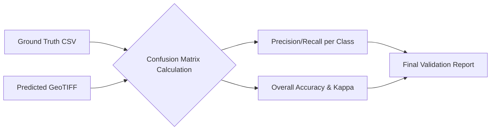

# Chapter 4: Results & Interpretation

Running the models and generating classified images is only half the battle. A Data Scientist must rigorously prove the validity of those predictions. This chapter breaks down how we evaluate our models, mathematically and visually, to determine which "engine" truly performed best.

## 1. Core Concept: The "Why"
In remote sensing, visual inspection is deceptive. A classified map might "look" right, but could be fundamentally flawed. Therefore, we rely on a statistical framework called Accuracy Assessment.

By comparing a stratified random sample of our model's predictions against known "Ground Truth" data (validation points we held out from training), we can construct a Confusion Matrix. From this matrix, we derive powerful metrics that tell us not only *if* the model is right, but *how* it is right (or wrong).

## 2. Mathematical Foundations: Accuracy Metrics

### The Confusion Matrix
A Confusion Matrix $M$ for $K$ classes is a $K \times K$ table where each element $M_{ij}$ represents the number of pixels belonging to true class $i$ but predicted as class $j$.

### Overall Accuracy (OA)
The ratio of correctly classified pixels to the total number of pixels $N$.
$$ \text{OA} = \frac{\sum_{i=1}^{K} M_{ii}}{N} $$

### User's Accuracy (Precision) & Producer's Accuracy (Recall)
- **User's Accuracy (Precision for Class $i$):** If the map says a pixel is Forest, what is the probability it actually is Forest on the ground?
  $$ \text{UA}_i = \frac{M_{ii}}{\sum_{j=1}^{K} M_{ji}} $$
- **Producer's Accuracy (Recall for Class $i$):** Out of all actual Forest pixels on the ground, what proportion did the model correctly identify?
  $$ \text{PA}_i = \frac{M_{ii}}{\sum_{j=1}^{K} M_{ij}} $$

### F1-Score
The harmonic mean of User's and Producer's Accuracy, providing a single metric for class-specific performance.
$$ \text{F1}_i = 2 \cdot \frac{\text{UA}_i \cdot \text{PA}_i}{\text{UA}_i + \text{PA}_i} $$

### Kappa Coefficient ($\kappa$)
Kappa measures the agreement between classification and truth values, adjusted for chance agreement.
$$ \kappa = \frac{N \sum_{i=1}^{K} M_{ii} - \sum_{i=1}^{K} (M_{i+} \cdot M_{+i})}{N^2 - \sum_{i=1}^{K} (M_{i+} \cdot M_{+i})} $$
Where $M_{i+}$ is the sum of row $i$ (true total), and $M_{+i}$ is the sum of column $i$ (predicted total). A Kappa of 1 indicates perfect agreement, while 0 indicates entirely random predictions.

## 3. Logic Workflow: Evaluating the Outputs

The evaluation logic resides primarily in `Accuracy Assessment and Visualisation/Accuracy_assessment.ipynb`.

1. **Prediction Ingestion:** The final classified GeoTIFFs (RF, CNN-9, CNN-15) are loaded.
2. **Reference Data Alignment:** A `.csv` containing validation points (`reference_data.csv`) is loaded.
3. **Point Extraction:** For every validation point $(lon, lat)$, the predicted class is extracted from the GeoTIFF array.
4. **Metric Calculation:** Functions such as `sklearn.metrics.confusion_matrix` and `sklearn.metrics.cohen_kappa_score` are utilized to directly compute the mathematical metrics defined above.
5. **Report Generation:** A comprehensive document (`model_accuracy_report.docx`) is synthesized, summarizing the performance.

## 4. Visual Representations & Output Analysis

*Note: Visual results generated by this codebase are stored in the `Results/` directory.*

- **Classified Images (`Results/Classified Images/`):** You will find `.tif` files showing the spatial distribution of the 6 LULC classes. Upon visual inspection, CNN models generally exhibit smoother contiguous regions (e.g., solid blocks of agricultural land), whereas the RF model often looks "speckled" due to pixel-by-pixel noise.
- **Area Statistics (`Results/Comparison Results/`):** Graphs such as `LULC_class_area.png` show the total acreage predicted for each class. Comparing these charts reveals systemic biases; for instance, if RF predicts 20% more "Settlement" area than the CNN, it suggests RF is over-classifying noise as urban infrastructure.

## 5. Educational Deep-Dive: The "Grading a Test" Analogy

Imagine a teacher grading a multiple-choice geography test.

- **Overall Accuracy** is simple: The student got 85 out of 100 questions right. Grade: 85%.
- **Producer's Accuracy (Recall):** Out of the 10 questions that were actually about Mountains, how many did the student get right? If they only got 5, their "Recall" for mountains is low. They missed half of them.
- **User's Accuracy (Precision):** Every time the student wrote "Mountain" as the answer, how often were they right? If they guessed "Mountain" 20 times, but only 5 were correct, their "Precision" is terrible. They are crying wolf.
- **Kappa Statistic:** Imagine a student who knows absolutely nothing but just guesses "C" for every question. By sheer luck, they might get 25% Overall Accuracy. The Kappa Statistic penalizes the student for this blind guessing, revealing their true competence.
