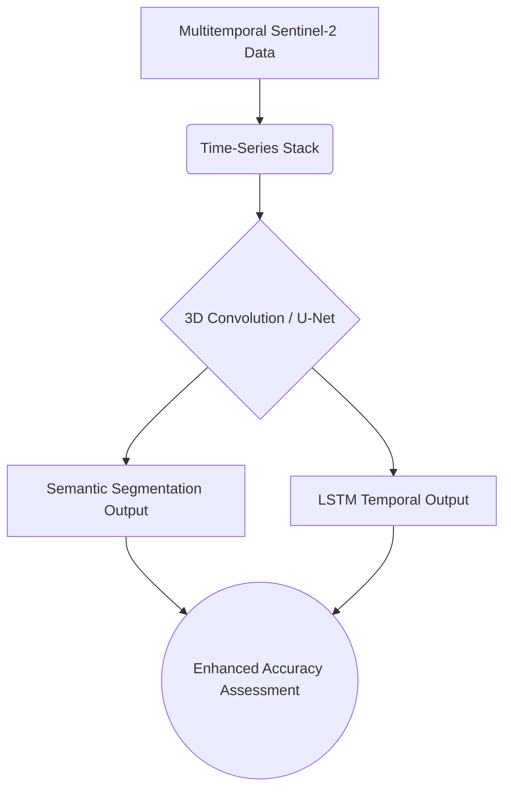

# Chapter 5: Expansion & References

As we conclude this Master Technical Manuscript, it is crucial to recognize that the architectures and pipelines detailed here are built upon decades of foundational research in both Geoinformatics and Computer Science. This final chapter provides academic anchors for the methods utilized and suggests avenues for pushing this codebase further.

## 1. Core Concept: The "Why"
In both academia and industry, "standing on the shoulders of giants" is not just a metaphor; it is a rigorous requirement. Referencing established literature validates our methodological choices (e.g., using a $15 \times 15$ CNN patch size versus a Random Forest pixel approach).

Furthermore, a codebase is never truly "finished." Documenting expansion pathways ensures that future students or junior developers can inherit this project and elevate it to the next state-of-the-art standard.

## 2. Academic Citations & Foundations

The techniques implemented in this repository are supported by the following core concepts in remote sensing and machine learning literature:

### Random Forest Classification in GEE
The use of ensemble tree methods for multi-spectral classification is a standard baseline.
> **Reference:** Breiman, L. (2001). *Random Forests.* Machine Learning, 45(1), 5-32.
> *Context:* Foundation of the Random Forest algorithm utilized via `ee.Classifier.smileRandomForest` in our Google Earth Engine scripts.

> **Reference:** Gorelick, N., Hancher, M., Dixon, M., Ilyushchenko, S., Thau, D., & Moore, R. (2017). *Google Earth Engine: Planetary-scale geospatial analysis for everyone.* Remote Sensing of Environment, 202, 18-27.
> *Context:* Justifies the use of GEE for scalable data compositing and baseline classification.

### Patch-Based Convolutional Neural Networks
The transition from pixel-based to spatial-context-based classification (extracting $9 \times 9$ and $15 \times 15$ patches) reflects the shift toward Deep Learning in GIS.
> **Reference:** LeCun, Y., Bengio, Y., & Hinton, G. (2015). *Deep learning.* Nature, 521(7553), 436-444.
> *Context:* Foundational text on the architecture of CNNs used in our Python pipeline.

> **Reference:** Sharma, A., Liu, X., Yang, X., & Shi, D. (2017). *A patch-based convolutional neural network for remote sensing image classification.* Neural Networks, 95, 19-28.
> *Context:* Validates the specific methodology of taking an $N \times N$ spatial patch around a central pixel to improve LULC classification accuracy over traditional methods.

### Accuracy Assessment
> **Reference:** Olofsson, P., Foody, G. M., Herold, M., Stehman, S. V., Woodcock, C. E., & Wulder, M. A. (2014). *Good practices for estimating area and assessing accuracy of land change.* Remote Sensing of Environment, 148, 42-57.
> *Context:* Provides the mathematical rigor behind the metrics (User/Producer accuracy, Kappa) calculated in Chapter 4.

## 3. Logic Workflow: Avenues for Expansion

If you are a student looking to expand this repository, consider the following technical workflows:

1. **U-Net Integration (Semantic Segmentation):**
   - *Current Logic:* We extract patches and classify only the center pixel (Patch-based CNN).
   - *Expansion:* Replace the Sequential CNN with a fully convolutional architecture like U-Net. Instead of predicting one pixel per patch, predict a $256 \times 256$ label grid for a $256 \times 256$ input image simultaneously.
2. **Multi-Temporal Data Fusion:**
   - *Current Logic:* We use a static composite image.
   - *Expansion:* Modify the GEE script to export a time-series stack (e.g., Spring, Summer, Fall imagery). Modify the CNN input shape to $N \times N \times \text{Bands} \times \text{Time}$, and implement Recurrent Neural Networks (LSTMs) or 3D Convolutions to capture seasonal changes in vegetation.
3. **Hyperparameter Optimization:**
   - *Current Logic:* The $9 \times 9$ and $15 \times 15$ architectures are manually defined.
   - *Expansion:* Integrate a library like Optuna (mentioned in the README) directly into `cnn_training_15.ipynb` to programmatically search for the optimal learning rate, dropout rate, and kernel sizes.

## 4. Educational Deep-Dive: The "Evolution of Vehicles" Analogy

The future of ML in GIS is like the evolution of transportation.

- **Random Forest is the Bicycle:** It's reliable, easy to understand, easy to fix, and gets you from point A to point B efficiently. For many standard remote sensing tasks, it is perfectly sufficient.
- **The Patch-Based CNN is the Car:** It requires more fuel (data) and a more complex engine (TensorFlow/GPUs). It can carry more complex information (spatial context) and perform better on difficult terrain (noisy urban environments).
- **U-Net / Semantic Segmentation (The Expansion) is the High-Speed Train:** It requires entirely new infrastructure. Instead of carrying one passenger (pixel) at a time, it evaluates entire neighborhoods of pixels simultaneously, making it incredibly fast and context-aware for large-scale production mapping.

The goal of a Data Scientist is not to always build a high-speed train, but to know *which* vehicle is appropriate for the terrain of the problem at hand.

## 5. Visual Representations: Expansion Architecture

## 6. Mathematical Foundations: U-Net Loss

If you implement Semantic Segmentation (e.g., U-Net) for expansion, you will likely shift from standard Categorical Cross-Entropy to a Dice Loss (or a combination thereof) to handle severe class imbalances (e.g., small mining areas vs. vast forests). The Dice Coefficient is defined as:

$$ \text{Dice} = \frac{2 |A \cap B|}{|A| + |B|} $$
Where $A$ is the predicted boolean mask for a class and $B$ is the true mask. The Dice Loss is simply $1 - \text{Dice}$.
