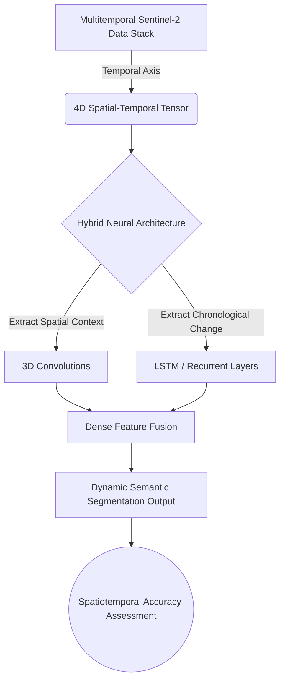

# Chapter 5: Expansion & References

As we conclude this Master Technical Manuscript, it is imperative to explicitly recognize that the architectures, preprocessing pipelines, and statistical methodologies detailed herein are not isolated inventions. They are built atop decades of rigorous, peer-reviewed foundational research traversing Geoinformatics, Statistics, and Computer Science.

This final chapter serves two vital purposes. First, it provides the academic anchors validating our specific methodological choices (e.g., the theoretical justification for evaluating spatial context via CNN patches versus pixel-independent classification). Second, recognizing that no technological codebase is ever truly "finished," it outlines advanced theoretical vectors for future expansion. This ensures that incoming students or junior architects can inherit this repository and rapidly elevate it to the next state-of-the-art benchmark.

## 1. Academic Citations & Theoretical Foundations

The techniques engineered within this repository are explicitly supported by the following core literature in the domains of remote sensing and machine learning:

### Random Forest Classification in Cloud Environments
The utilization of ensemble decision tree methods for multi-spectral remote sensing classification is a well-established global baseline.
> **Reference:** Breiman, L. (2001). *Random Forests.* Machine Learning, 45(1), 5-32.
> *Context:* This is the foundational mathematical text outlining the Random Forest algorithm, which we instantiate via `ee.Classifier.smileRandomForest` within our Google Earth Engine workflow.

> **Reference:** Gorelick, N., Hancher, M., Dixon, M., Ilyushchenko, S., Thau, D., & Moore, R. (2017). *Google Earth Engine: Planetary-scale geospatial analysis for everyone.* Remote Sensing of Environment, 202, 18-27.
> *Context:* Provides the architectural and theoretical justification for utilizing the GEE platform for highly scalable, planetary-level data compositing and baseline classification.

### Spatial Feature Extraction via CNNs
The transition from pixel-centric models to spatial-context-aware classification (via the extraction of localized $9 \times 9$ and $15 \times 15$ topological patches) reflects a massive paradigm shift in modern GIS.
> **Reference:** LeCun, Y., Bengio, Y., & Hinton, G. (2015). *Deep learning.* Nature, 521(7553), 436-444.
> *Context:* The definitive review paper on the backpropagation and gradient-descent architectures of Deep Convolutional Neural Networks utilized in our Python/TensorFlow pipeline.

> **Reference:** Sharma, A., Liu, X., Yang, X., & Shi, D. (2017). *A patch-based convolutional neural network for remote sensing image classification.* Neural Networks, 95, 19-28.
> *Context:* This paper directly validates our specific data-engineering methodology: extracting an $N \times N$ spatial tensor around a central coordinate to significantly improve LULC classification accuracy over traditional spectral-only methods.

### Rigorous Accuracy Assessment
> **Reference:** Olofsson, P., Foody, G. M., Herold, M., Stehman, S. V., Woodcock, C. E., & Wulder, M. A. (2014). *Good practices for estimating area and assessing accuracy of land change.* Remote Sensing of Environment, 148, 42-57.
> *Context:* Provides the stringent statistical framework and mathematical rigor behind the metrics (User/Producer accuracy, Kappa Coefficient) calculated in Chapter 4, ensuring our evaluation methodologies meet strict academic standards.

## 2. Logic Workflow: Vectors for Advanced Expansion

If you are an engineer or researcher looking to substantially expand the capabilities of this repository, consider implementing the following advanced workflows:

1. **Semantic Segmentation via U-Net Architectures:**
   - *Current Constraint:* Our current patch-based CNN extracts an $N \times N$ spatial tensor but only predicts the class label for the *single central pixel*. This requires overlapping patches during inference, which is highly computationally inefficient.
   - *Expansion Vector:* Replace the `Sequential` classification CNN with a Fully Convolutional Network (FCN), specifically a U-Net architecture. Instead of outputting a single probability distribution, a U-Net digests a massive $256 \times 256$ input tensor and simultaneously outputs a $256 \times 256$ grid of predictions, effectively classifying entire neighborhoods in a single forward pass.

2. **Multi-Temporal Data Fusion (Spatiotemporal Modeling):**
   - *Current Constraint:* The model operates on a single, temporally static composite image (e.g., a "Summer" mosaic). It lacks the ability to understand chronological change.
   - *Expansion Vector:* Modify the GEE pipeline to export a chronological time-series stack (e.g., imagery from Spring, Summer, Fall, and Winter). Modify the CNN input dimensionality from 3D to 4D ($H \times W \times \text{Bands} \times \text{Time}$). Implement Recurrent Neural Network layers (like LSTMs) or 3D Convolutions (`Conv3D`) to capture the temporal phenology of the landscape, drastically improving the classification of seasonal agriculture versus evergreen forests.

3. **Algorithmic Hyperparameter Optimization (HPO):**
   - *Current Constraint:* The architectural hyperparameters for the $9 \times 9$ and $15 \times 15$ models (e.g., kernel sizes, dropout rates, learning rates) are statically defined based on manual heuristics.
   - *Expansion Vector:* Programmatically integrate a Bayesian optimization framework, such as Optuna, directly into the training loops. This allows the system to autonomously explore the high-dimensional hyperparameter space to locate the absolute mathematical optimum for convergence speed and generalization.

## 3. Mathematical Foundations: Optimization via Dice Loss

If you choose to implement the Semantic Segmentation (U-Net) expansion, you will encounter a critical mathematical hurdle: extreme class imbalance. For instance, tiny "Mining" facilities might occupy less than 1% of the pixels, while "Forest" occupies 70%. Standard Categorical Cross-Entropy loss will cause the network to simply ignore the minority classes.

To solve this, modern segmentation architectures optimize the **Dice Loss**, which directly measures spatial overlap rather than pixel-by-pixel probabilities. The Dice Coefficient for a specific class is defined as:

$$ \text{Dice} = \frac{2 |A \cap B|}{|A| + |B|} $$

Where:
- $A$ is the predicted boolean mask array for the specific class.
- $B$ is the true ground-truth mask array.
- $| \cdot |$ denotes the cardinality (the number of positive pixels) of the set.

The network is then trained to minimize the Dice Loss:
$$ \mathcal{L}_{\text{Dice}} = 1 - \text{Dice} $$

Because this function calculates the ratio of intersection to the total area of the sets, it fundamentally ignores massive expanses of correctly classified "background" pixels, forcing the network to focus heavily on accurately tracing the boundaries of minority classes.

## 4. Visual Representations: Spatiotemporal Expansion Architecture

## 5. Educational Deep-Dive: The "Evolution of Vehicles" Analogy

The historical progression of Machine Learning architectures within GIS perfectly mirrors the evolution of vehicular transportation.

- **The Random Forest is the Bicycle:** It is mechanically simple, highly reliable, easy to troubleshoot, and gets you from point A to point B with minimal energy. For many straightforward remote sensing tasks, it is perfectly sufficient and building anything larger is a waste of resources.
- **The Patch-Based CNN is the Automobile:** It requires significantly more fuel (massive datasets) and a far more complex internal combustion engine (TensorFlow running on GPUs). However, it can carry more complex information (deep spatial context) and performs drastically better on difficult, noisy terrain (complex urban environments).
- **U-Net / Semantic Segmentation (The Expansion) is the High-Speed Rail Network:** It requires laying down entirely new infrastructure. Instead of carrying one passenger (evaluating one pixel) at a time, it transports massive neighborhoods of pixels simultaneously. It is incredibly fast and context-aware, designed explicitly for massive-scale production mapping.

The ultimate goal of a Lead Data Scientist is not to always demand the high-speed train; it is to deeply understand the mathematical terrain of the problem and intelligently select the vehicle that best solves it.